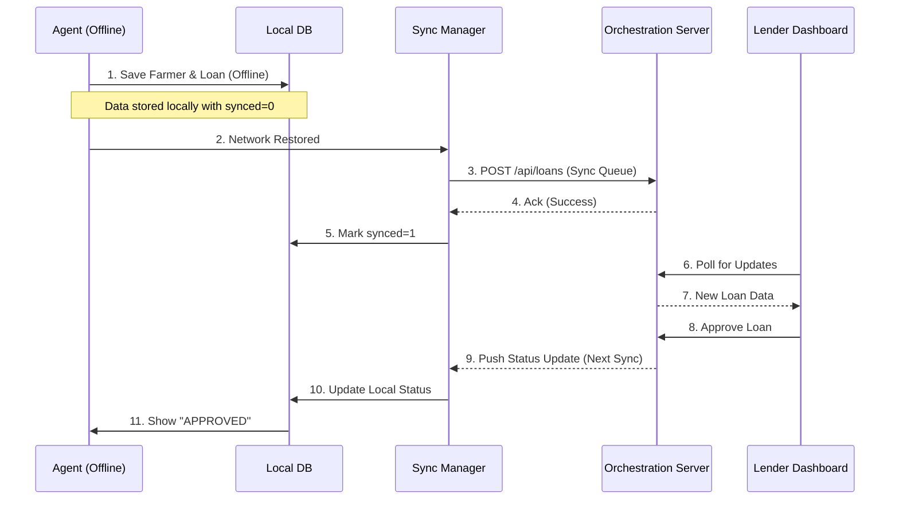

# System Architecture - FarmCredit Connect

## Overview
FarmCredit Connect is designed as a **Hub-and-Spoke** architecture where the central "Orchestration Layer" (Server) manages data flow between offline-first "Spokes" (Field Agent Clients) and the "Control Center" (Lender Dashboard).

## Components

### 1. Field Agent Client (The Spoke)
*   **Type**: Progressive Web App (PWA)
*   **Tech**: React, TypeScript, Vite, IndexedDB
*   **Responsibility**: 
    *   Data Collection (Farmer Profiles, Loan Requests)
    *   Offline Storage (Persistence via `idb`)
    *   Sync Management (Queue-based synchronization)
*   **Key Modules**:
    *   `db.ts`: Wrapper around IndexedDB for local CRUD.
    *   `sync.ts`: Background worker that pushes/pulls data when `navigator.onLine` is true.

### 2. Orchestration Layer (The Hub)
*   **Type**: REST API Server
*   **Tech**: Node.js, Express, SQLite
*   **Responsibility**:
    *   Central Source of Truth
    *   Conflict Resolution (Last-write-wins for simple fields)
    *   Integration Mocking (Govt Schemes, Lender Webhooks)
*   **Data Model**:
    *   `farmers`: Stores identity and land details.
    *   `loans`: Stores loan applications and status history.

### 3. Lender Dashboard (The Control Center)
*   **Type**: Single Page Application (SPA)
*   **Tech**: React, Recharts
*   **Responsibility**:
    *   Visualization of incoming requests.
    *   Decision making (Approve/Reject).

## Data Flow Diagram

